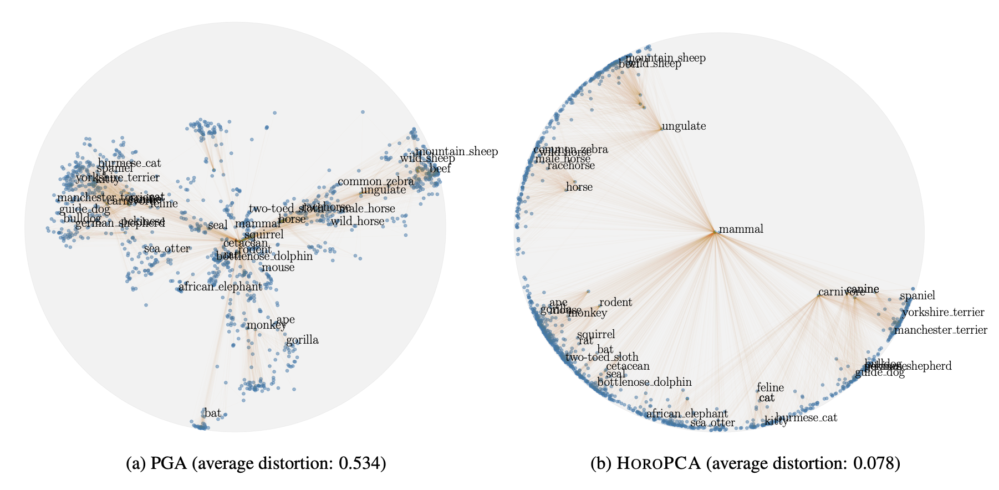

# HoroPCA

This code is the official PyTorch implementation of the ICML 2021 paper: 

> **HoroPCA: Hyperbolic Dimensionality Reduction via Horospherical Projections**\
> Ines Chami*, Albert Gu*, Dat Nguyen, Christopher Ré\
> Stanford University\
> Paper: [TODO: add arxiv link]



> **Abstract.** This paper studies Principal Component Analysis (PCA) for data lying in hyperbolic spaces. Given directions, PCA relies on: (1) a parameterization of subspaces spanned by these directions, (2) a method of projection onto subspaces that preserves information in these directions, and (3) an objective to optimize, namely the variance explained by projections. We generalize each of these concepts to the hyperbolic space and propose HoroPCA, a method for hyperbolic dimensionality reduction. By focusing on the core problem of extracting principal directions, HoroPCA theoretically better preserves information in the original data such as distances, compared to previous generalizations of PCA. Empirically, we validate that HoroPCA outperforms existing dimensionality reduction methods, significantly reducing error in distance preservation. As a data whitening method, it improves downstream classification by up to 3.9% compared to methods that don’t use whitening. Finally, we show that HoroPCA can be used to visualize hyperbolic data in two dimensions.

The code has an implementation of the HoroPCA method, as well as other methods for dimensionality reduction on manifolds, such as Principal Geodesic Analysis and tangent Principal Component Analysis.  

## Installation 

This code was tested on Python3.7 and Pytorch 1.8.1. Start by installing the requirements: 
```bash
pip install -r requirements.txt
```


## Usage 

### Main script

Run hyperbolic dimensionality reduction experiments using the `main.py` script. 
```
python main.py --help

optional arguments:
  -h, --help            show this help message and exit
  --dataset {smalltree,phylo-tree,bio-diseasome,ca-CSphd}
                        which datasets to use
  --model {pca,tpca,pga,bsa,hmds,horopca}
                        which dimensionality reduction method to use
  --metrics METRICS [METRICS ...]
                        which metrics to use
  --dim DIM             input embedding dimension to use
  --n-components N_COMPONENTS
                        number of principal components
  --lr LR               learning rate to use for optimization-based methods
  --n-runs N_RUNS       number of runs for optimization-based methods
  --use-sarkar          use sarkar to embed the graphs
  --sarkar-scale SARKAR_SCALE
                        scale to use for embeddings computed with Sarkar's
                        construction
```
### Examples

#### 1. Run HoroPCA on the smalltree dataset:
```
python main.py --dataset smalltree --model horopca --dim 10 --n-components 2
```
Output: 
```
distortion: 	0.19 +- 0.00
frechet_var: 	7.15 +- 0.00
```

#### 2. Run Euclidean PCA on the smalltree dataset:
```
python main.py --dataset smalltree --model pca --dim 10 --n-components 2
```
Output: 
```
distortion: 	0.84 +- 0.00
frechet_var:    0.34 +- 0.00
```


### Datasets
The possible dataset choices  in this repo are `{smalltree,phylo-tree,bio-diseasome,ca-CSphd}`.
To add a new dataset, add the corresponding edge list and embedding file in the `data/` folder. 


## Citation
If you use this codebase, or otherwise found our work valuable, please cite:
```
[TODO: add citation]
```